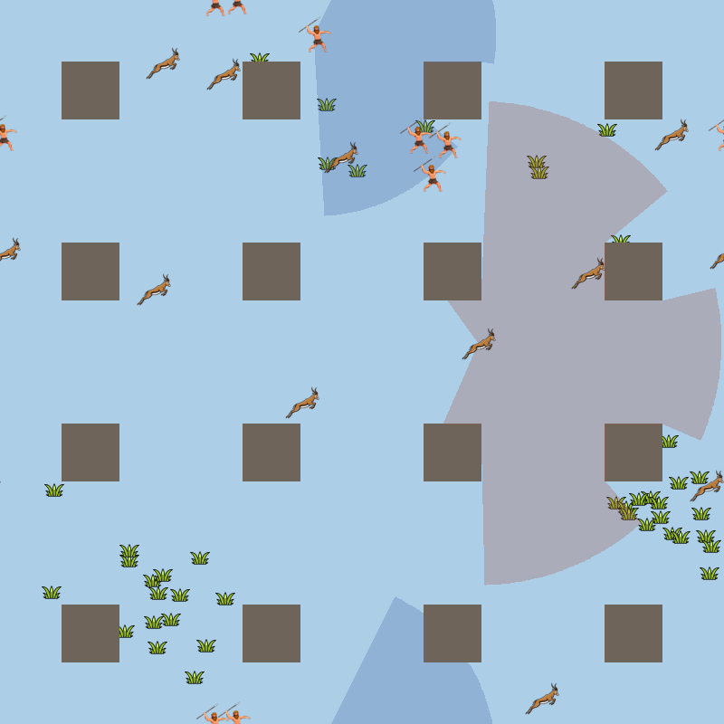

# PredPreyGrassContinuous

*`add_walls` with the policies trained in run O: predators hunt prey, prey
graze the grass, and the walls block movement and sight. The two shaded
cones are the view of one predator (blue, 150°, wrapping across the arena's
edge) and one prey (grey, 240°), cut off where walls block the view.*

A continuous-space counterpart to the grid-based
[PredPreyGrass](https://github.com/doesburg11/PredPreyGrass): multi-agent
reinforcement learning for predators and prey, built on the physics-based
[Aquarium](https://github.com/michaelkoelle/marl-aquarium) environment and
trained with RLlib's new API stack (RLModule + Learner).

## Layout

- [`dying_prey/`](dying_prey/) — Aquarium PPO training with permanent prey deaths.
  See its [README](dying_prey/README.md) for installation and evaluation.
- [`add_grass/`](add_grass/) — a contained experiment adding stationary grass,
  food rewards, delayed regrowth, and nearest-visible-grass inputs for prey.
  See its [README](add_grass/README.md).
- [`add_energy/`](add_energy/) — `add_grass` plus metabolic energy: decay,
  food from grass and catches, starvation for both species, and an own-energy
  input. See its [README](add_energy/README.md).
- [`add_reproduction/`](add_reproduction/) — `add_energy` plus births at an
  energy threshold, populations that change during an episode, PredPreyGrass's
  starting populations, its sparse +10-per-birth reward, and grass that grows
  in clusters that move as the prey graze them. See its
  [README](add_reproduction/README.md), and its
  [RESULTS](add_reproduction/RESULTS.md) for the log of all training runs
  and what they showed.
- [`add_walls/`](add_walls/) — `add_reproduction` plus walls that block
  movement and sight, so animals can hide, actions at full speed, half speed
  or stopped with movement energy costs, and observations computed once per
  decision to reduce environment-stepping overhead. See its
  [README](add_walls/README.md), and its
  [RESULTS](add_walls/RESULTS.md) for its training runs.
- [`add_group_hunting/`](add_group_hunting/) — `add_walls` (walls off) plus
  group hunting: a catch is a contest between the summed energy of nearby
  predators and the prey's energy, and is shared among the hunters; every
  observed animal shows its energy. See its
  [README](add_group_hunting/README.md), and its
  [RESULTS](add_group_hunting/RESULTS.md) for its training runs.

## Grass: from static patches to moving clusters

In every module, grass consists of patches that prey eat when they come
close. An eaten patch disappears and regrows after a delay. The modules
differ in where grass grows:

- **`add_grass`, `add_energy`:** patches are scattered at random and always
  regrow in exactly the same spot, so the food landscape stays fixed for a
  whole episode.
- **`add_reproduction`:** grass can grow in **clusters that move**, driven by
  the prey themselves through two mechanisms modeled on vegetation ecology:
  - **Seed dispersal:** an eaten patch regrows next to a surviving patch of
    its own cluster. Grass spreads where it survives and retreats where it
    is eaten, so a cluster creeps away from heavy grazing.
  - **Overgrazing:** a cluster grazed completely bare dies back and, after a
    delay, regrows in a different, unoccupied part of the arena.

  Together these create a shifting food landscape: prey must keep finding
  food, and predators can learn where prey gather. Each mechanism has its
  own switch, alongside scattered placement and random regrowth, so static
  and moving grass can be compared. The
  [add_reproduction README](add_reproduction/README.md#grass) describes the
  mechanisms step by step, with all settings.

## Walls: places to hide

`add_walls` adds **walls**: obstacles that block both movement and sight, as
in PredPreyGrass's walls-and-occlusion experiments. Animals
slide along walls instead of passing through them. Anything behind a wall is
hidden from view, so prey can hide and predators can ambush. Every agent
senses nearby walls through a few distance inputs. Layouts include a "forest"
of square blocks, four rooms connected by doorways, and custom rectangles.
Occlusion uses a precomputed cell-to-cell line-of-sight table, so it costs a
table lookup per check during an episode. The viewer clips the view cones of
one predator and one prey at the walls, so you can watch what each animal can
and cannot see. Walls are set with `walls_layout` (default `"blocks"`). See the
[add_walls README](add_walls/README.md#walls) for how they work.

All subprojects share one Conda environment at the repo root (`.conda/`).
Training settings live in each module's `config/config_env.py` and
`config/config_ppo.py`; run training without command-line arguments.
